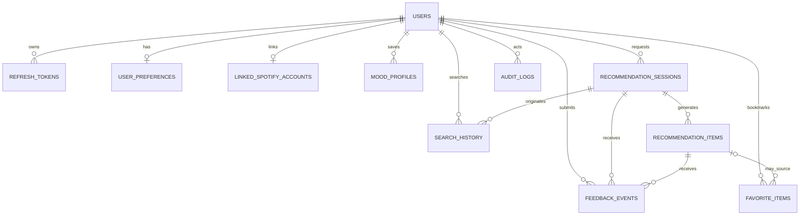

# SSD Domain Model

## Aggregate Boundaries

- `User` is the identity and profile aggregate root. It owns registration state, refresh tokens, onboarding preferences, saved mood profiles, and the optional Spotify link.
- `RecommendationSession` is the recommendation aggregate root. It captures one mood-driven discovery request plus its generated recommendation items and any feedback collected during or after the session.
- `FavoriteItem` is stored under a user scope but treated as an independent aggregate for write simplicity and fast deduplication.
- `SearchHistory` and `AuditLog` are append-only records. They are intentionally isolated from mutable profile state so read/write volume can scale independently.

## ERD

## Table Guide

### `ssd.users`

Primary identity table. Stores login email, normalized email for uniqueness, password hash metadata, lifecycle status, and core timestamps. This is the anchor table for the rest of the user-facing product.

### `ssd.refresh_tokens`

Stores hashed refresh tokens only, never raw tokens. It supports token rotation, device tracing, revocation, and expiration-based cleanup. This table is optimized for secure authentication workflows.

### `ssd.user_preferences`

One row per user for onboarding defaults and standing recommendation preferences. It keeps the mobile onboarding flow and recommendation engine aligned without polluting the `users` table.

### `ssd.mood_profiles`

Saved mood templates a user can return to later. These capture a named mood, optional energy and time-of-day defaults, content toggles, and genre include/exclude lists.

### `ssd.linked_spotify_accounts`

One-to-one optional Spotify integration state for a user. It stores Spotify identity metadata, encrypted token material, granted scopes, sync timestamps, and link status.

### `ssd.recommendation_sessions`

Represents a single recommendation request. It persists the selected mood filters, execution status, correlation id, result counts, and completion/failure metadata so the app can show recommendation history and operational traces.

### `ssd.recommendation_items`

The concrete songs or movies generated for a session. It stores provider identifiers, titles, descriptions, genres, ranking, match score, family-friendly flags, release metadata, and the explanation shown to the user.

### `ssd.favorite_items`

The user’s saved content list. It is intentionally denormalized from provider data so favorites survive session cleanup and still render quickly without replaying recommendation sessions.

### `ssd.feedback_events`

Append-only record of optional likes, dislikes, and skips. It links feedback to both the session and, when available, the individual recommendation item so downstream personalization can learn from it.

### `ssd.search_history`

Stores search and filter activity, including free-text query, search domain, JSON filter snapshot, result count, and optional link back to the recommendation session it triggered.

### `ssd.audit_logs`

Append-only operational audit trail. It captures actor type, action, target entity, correlation id, optional user/IP context, and JSON metadata for security reviews and production diagnostics.

## Indexing Strategy

- `users.normalized_email` unique: enforces one account per email and speeds login lookup.
- `refresh_tokens.token_hash` unique: supports direct token validation and revocation checks.
- `refresh_tokens(user_id, expires_utc)`: supports active-token cleanup and account-level token views.
- `user_preferences.user_id` unique: guarantees one preference row per user.
- `linked_spotify_accounts.user_id` unique: guarantees one Spotify link per user.
- `linked_spotify_accounts.spotify_user_id` unique: prevents two SSD users sharing one Spotify account.
- `mood_profiles(user_id, is_default)` filtered on `is_default = true`: guarantees efficient lookup of a user’s default mood profile.
- `recommendation_sessions.correlation_id` unique: supports distributed tracing and idempotent diagnostics.
- `recommendation_sessions(user_id, requested_utc)`: supports history timelines.
- `recommendation_items(recommendation_session_id, rank)` unique: keeps session result ordering stable.
- `recommendation_items(provider, provider_content_id)`: speeds content deduplication and feedback joins.
- `favorite_items(user_id, content_type, provider, provider_content_id)` unique: prevents duplicate favorites.
- `feedback_events(user_id, created_utc)`: supports recent-feedback analytics.
- `feedback_events(recommendation_session_id)`: supports session detail retrieval.
- `search_history(user_id, created_utc)`: supports recent-search screens.
- `search_history.recommendation_session_id`: supports reverse lookup from session to originating search.
- `audit_logs.created_utc`, `audit_logs.correlation_id`, `audit_logs(entity_name, entity_id)`: support incident review and entity-level audit trails.
